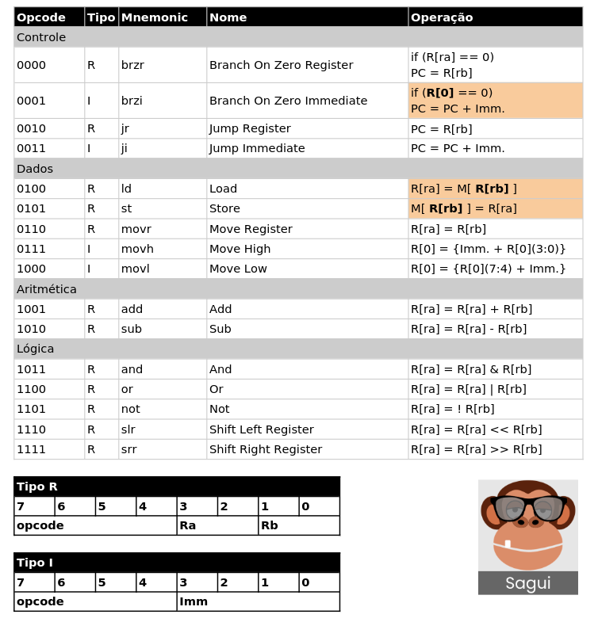

[Ler esse documento em português](sagui-doc-pt.md)

# Sagui for EGG

Sagui is a fantasy 8 bit RISC architecture created by Dr. Marco Zanata,
professor at Universidade Federal do Paraná. The implementation in EGG has one
extension: a instruction `movr r0, r0` is actually interpreted as a BREAK system
call.

It uses the standard Assembly syntax described in the [README](README.md). It's
assembler is very dumb, tho. It'll not fix any relative-addressed immediate, so
basically you're on your own to compute all jumps manually. Good luck.

